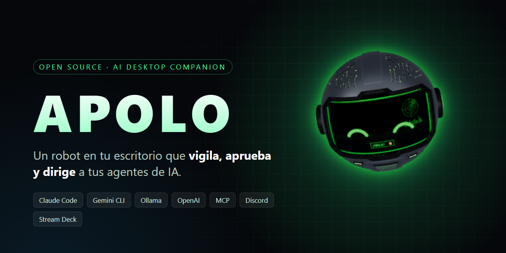
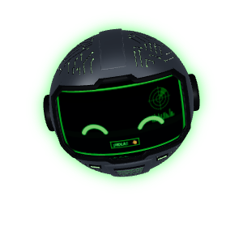
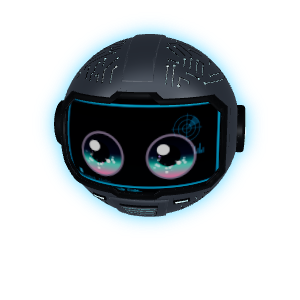
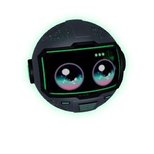
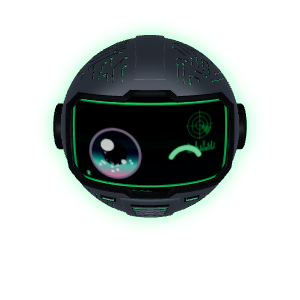
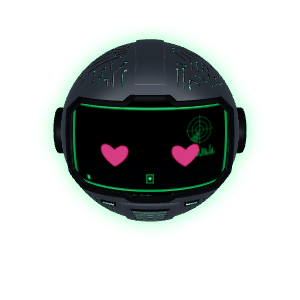
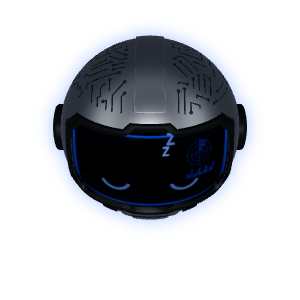
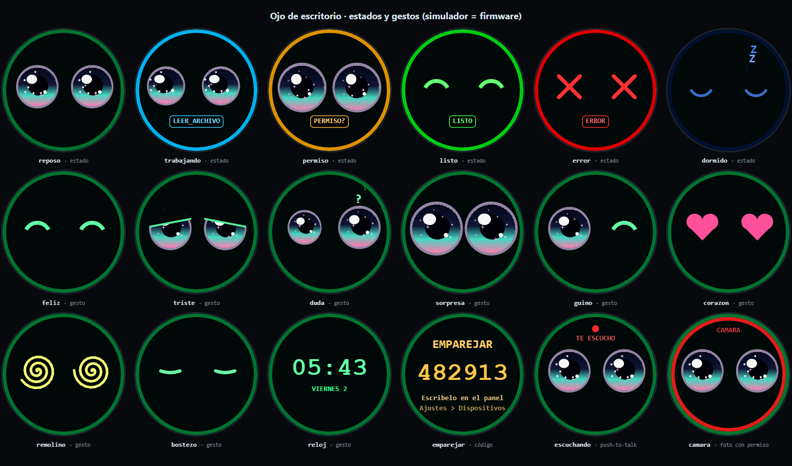

<p align="center">
  
</p>

<p align="center">
  <a href="https://github.com/DMNENGINE/apolo/actions/workflows/test.yml"></a>
  <a href="https://github.com/DMNENGINE/apolo/releases/latest"></a>
  <a href="LICENSE"></a>
  
  
</p>

<p align="center"><a href="README.md">English</a> · <b>Español</b></p>

<h3 align="center">Un robot 3D en tu escritorio que lanza, vigila y aprueba todos tus agentes de IA — con el plan que ya pagas, o 100 % local.</h3>

<p align="center">
  
  
  
  
  
  
</p>

APOLO vive arriba de tu pantalla como un casco animado. Hace de relé de las sesiones de **Claude Code** y **Gemini CLI**, tiene su propio **núcleo de agente multi-modelo** (Ollama, OpenAI, Anthropic, Gemini, OpenRouter, Groq…) y te pregunta antes de cualquier cosa arriesgada: desde la isla flotante, un Stream Deck, Discord, Telegram, WhatsApp o el móvil.

> **Beta.** De momento solo Windows 10/11. Lo marcado con 🧪 es experimental: funciona en el equipo del autor pero se ha probado poco fuera.

---

## Por qué engancha

| | |
|---|---|
| 💳 **Usa el plan que ya pagas** | Maneja Claude Code y ChatGPT/Codex con sus propias CLI: sin API key ni factura por token. APOLO muestra el consumo en **% de tu plan**, nunca en dólares, y pausa su trabajo de fondo cerca del límite. |
| 🏠 **Local y gratis** | Conéctalo a [Ollama](https://ollama.com) y el agente, los embeddings de la memoria y el enrutado corren en tu PC. |
| 🧩 **Skills universales + antivirus** | Instala skills `SKILL.md` desde una carpeta, un zip o GitHub (`usuario/repo`) y también lee las de `~/.claude/skills` y `~/.codex/skills`. Toda skill nueva llega **desactivada** y pasa por un "antivirus" estático + modelo (verde / amarillo / rojo). Las usa cualquier modelo, no solo Claude. |
| 🗳️ **Consejo de modelos** | Haz la misma pregunta a varios modelos (uno local, Claude y ChatGPT, por ejemplo). Responden en paralelo, ven las respuestas de los demás y pueden corregirse, y un moderador te da un veredicto con el grado de acuerdo. |
| 🌙 **Turno de noche** | Deja encargos antes de dormir. Cada uno trabaja en su propio **worktree y rama de git** (nunca hace push); los permisos arriesgados se deniegan y se apuntan en vez de despertarte, y en el desayuno tienes un informe y un vídeo vertical de ~60 s de la noche. |
| 🎁 **APOLO Wrapped** | Tarjetas semanales / mensuales: horas, rachas, modelo favorito, herramientas, lo que ahorraste en local. Privado por defecto (sin textos). Exporta PNG o vídeo. |
| 👁️ **Ojo de escritorio imprimible** 🧪 | Un "ojo" ESP32-S3 + pantalla redonda (~25 USD) que muestra el ánimo del robot, aprueba con un toque y deniega con pulsación larga. Incluye firmware, guía de montaje y simulador; la carcasa imprimible está en curso. → [docs/ojo](docs/ojo/README.md) |
| 🎥 **Co-host de streaming** 🧪 | Lee el chat de Twitch / YouTube, lo filtra, reacciona en un overlay de OBS y contesta con su voz. → [docs/stream.md](docs/stream.md) |
| 📦 **Migra desde OpenClaw** | Importa en un paso la memoria (`SOUL.md`, `USER.md`, `MEMORY.md`…), automatizaciones, agentes y skills de asistentes tipo OpenClaw. |

<p align="center">
  
</p>

## Y además

- 🏝️ **Isla flotante** — sesiones en vivo, subagentes, archivos que se escriben, consumo del plan y contexto por sesión.
- 🛡️ **Permisos desde cualquier sitio** — Permitir / Denegar / Siempre desde la isla, Stream Deck, Discord, Telegram, WhatsApp, la app móvil o el ojo. Los comandos peligrosos siempre piden una segunda confirmación.
- 🧠 **Núcleo de agente** — herramientas, memoria semántica persistente con consolidación nocturna, tareas programadas y heartbeat, subagentes en paralelo con Mission Control, compactación de contexto, servidor MCP, panel web, SDK de plugins.
- 🌐 **Agente de navegador** 🧪 — extensión para Chrome / Edge / Brave con permisos por sitio; nunca lee ni escribe campos de contraseña o tarjeta.
- 🖥️ **Control del PC** 🧪 — ve la pantalla y usa ratón y teclado con permiso por encargo, borde rojo y freno de pánico (basta mover el ratón).
- 📱 **App móvil (PWA)** 🧪 — se empareja con un QR; tokens de dispositivo con alcance limitado; PIN o passkey para aprobar lo peligroso.
- 🗣️ **Voz** — voz neural y reconocimiento local con Whisper (complemento opcional), o texto.
- 🔌 **Integraciones** — Discord, Telegram, WhatsApp 🧪, correo (Gmail / Outlook / IMAP), GitHub, Hugging Face, ElevenLabs, plugin de Stream Deck, hooks de Gemini CLI.

## Instalación

### Instalador de Windows (recomendado)

1. Descarga **`APOLO-Setup-x.y.z.exe`** de [Releases](https://github.com/DMNENGINE/apolo/releases/latest).
2. Ejecútalo. Se instala **por usuario** (sin administrador) en `%LOCALAPPDATA%\Programs\APOLO`, crea accesos en el menú Inicio y el escritorio, y pregunta si arrancar con Windows.
3. El instalador **aún no está firmado**: SmartScreen dirá "Windows protegió tu PC" → **Más información → Ejecutar de todas formas**.

Las actualizaciones llegan solas desde GitHub Releases (descarga diferencial); la isla pregunta antes de instalar. Al desinstalar se quitan los hooks de Claude Code / Gemini CLI y **pregunta** si borrar tus datos (`%APPDATA%\robot-companion`).

Instalación silenciosa: `APOLO-Setup-x.y.z.exe /S` (con `/D=C:\ruta` eliges la carpeta).

### Instalación de una línea (PowerShell)

```powershell
irm https://raw.githubusercontent.com/DMNENGINE/apolo/main/install.ps1 | iex
```

Instala Node.js, Electron y los paquetes de voz si faltan, deja APOLO en `%LOCALAPPDATA%\APOLO` y sigue la rama `main`. Vuelve a ejecutarlo para actualizar. Las dos instalaciones comparten la misma carpeta de datos.

### Desde el código

```powershell
git clone https://github.com/DMNENGINE/apolo.git
cd apolo
npm install
npm start
```

Para construir el instalador: `npm run dist` → `dist/APOLO-Setup-<versión>.exe`.

### Primeros pasos

Desde el icono de la bandeja:

1. **Instalar hooks** — conecta Claude Code (y Gemini CLI si lo tienes). Usa `node` si está instalado; si no, APOLO ejecuta el hook él mismo.
2. **Abrir panel de control** — el asistente de bienvenida elige modelo y canales en unos dos minutos.
3. **Instalar voz y micrófono** *(opcional)* — instala Python, `edge-tts` y `faster-whisper` en una ventana visible. Sin esto APOLO usa la voz de Windows.
4. **Extensión del navegador** *(opcional)* — bandeja → *Abrir carpeta de la extensión*, luego `chrome://extensions` → Modo desarrollador → **Cargar descomprimida**, y pega el token de *Copiar token para la extensión del navegador*.
5. **Stream Deck** *(opcional)* — ejecuta `streamdeck\instalar.ps1` desde la carpeta de la app (`resources\app.asar.unpacked\streamdeck` en la instalación .exe).

## Modelos compatibles

| Proveedor | Cómo | Coste |
|---|---|---|
| **Claude Code** (tu plan de Claude) | hooks + CLI `claude` | tu plan |
| **ChatGPT / Codex** (tu plan de ChatGPT) | CLI `codex` | tu plan |
| **Ollama** (Qwen, Gemma, Llama… y modelos `-cloud`) | API compatible con OpenAI | gratis / local |
| **OpenAI**, **OpenRouter**, **Groq** o cualquier servidor compatible con OpenAI | API key | por token |
| **API de Anthropic** | API key | por token |
| **Google Gemini** (API) y **Gemini CLI** (hooks) | API key / CLI | por token / plan |

Los modelos se escriben `proveedor/modelo` (p. ej. `ollama/qwen3.6`) y se eligen por canal; un enrutador automático manda lo de programar a Claude Code y el resto a tu modelo por defecto.

## Seguridad

- API local solo en `127.0.0.1` y con token en cada petición. El acceso desde el móvil por la red local es opcional y con alcance limitado.
- Los secretos se cifran con DPAPI de Windows y nunca se vuelven a mostrar; la memoria se niega a guardar claves o contraseñas.
- Lo peligroso siempre pregunta (dos veces si es destructivo); un único **pánico** (Stream Deck, ojo, isla) lo deniega todo y suelta el control.
- Registro de auditoría a prueba de manipulaciones de aprobaciones y acciones.
- Los plugins corren en un proceso aislado; las skills nuevas se escanean y quedan desactivadas hasta que las activas.
- Las ventanas y webs de bancos, carteras y gestores de contraseñas quedan fuera del control de pantalla y navegador.

Detalles en [SECURITY.md](SECURITY.md). ¿Encontraste una vulnerabilidad? Repórtala en privado como se explica ahí.

## Hoja de ruta

- [x] Instalador de una línea e instalador `.exe` con actualizaciones automáticas
- [x] Núcleo multi-modelo, motor de skills, consejo de modelos, turno de noche, Wrapped
- [x] App móvil, Telegram, WhatsApp, Discord, correo
- [ ] Instalador firmado
- [ ] **macOS y Linux** — el núcleo ya funciona ahí; el control del escritorio es solo Windows por ahora ([docs/portabilidad.md](docs/portabilidad.md))
- [ ] Carcasa imprimible del ojo (STL)
- [ ] Telemetría anónima opcional e informes de errores
- [ ] Tienda de skills en el panel

Plan completo: [docs/ROADMAP.md](docs/ROADMAP.md).

## Contribuir

Issues y PRs bienvenidos. Lee [CONTRIBUTING.md](CONTRIBUTING.md) y el [Código de conducta](CODE_OF_CONDUCT.md). Los tests del núcleo no necesitan dependencias (`cd core && npm test`) y la CI los corre en Windows y Linux.

## Licencia

[MIT](LICENSE) © DMNENGINE
