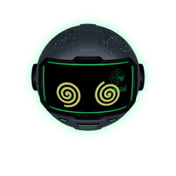

<p align="center">
  
</p>

<p align="center">
  <a href="https://github.com/DMNENGINE/apolo/actions/workflows/ci.yml"></a>
  <a href="LICENSE"></a>
  
  
  
</p>

<p align="center">
  <b>English</b> · <a href="README.es.md">Español</a>
</p>

**APOLO** is an open-source desktop companion that lives at the top of your screen as an animated 3D robot. It watches, approves and directs your AI agents: **Claude Code**, **Gemini CLI**, and its own **multi-model core** (Ollama, OpenAI, Anthropic, Gemini, OpenRouter…).

You stay in control. Every risky action asks first, from the floating island, Discord, a Stream Deck, or your phone.

---

## ✨ Features

| | |
|---|---|
| 🏝️ **Floating island** | Always-on-top HUD with live terminals, subagents, code being written, plan usage, and context per session. |
| 🛡️ **Permission control** | Allow, deny or "always allow" from the island, Discord, Stream Deck or mobile. Dangerous commands (`rm -rf`, `format`, …) need a second confirmation. |
| 🧠 **Multi-model core** | Its own agent loop with tools, persistent semantic memory, scheduled tasks, parallel subagents, context compaction and Mission Control. |
| 🌐 **Browser agent** | Chrome/Edge/Brave extension with per-site permissions. It never touches password or card fields. |
| 🖥️ **Computer use** | Sees the screen and uses mouse and keyboard with per-task consent, a visible red border and a panic stop (move the mouse to take back control). |
| 🗣️ **Voice** | Neural voice replies and speech input (Whisper), or plain text. |
| 🔌 **Integrations** | Web control panel, MCP server, Discord bot (it can run on a Raspberry Pi), Stream Deck plugin, Gemini CLI hooks. |
| 🤖 **Personality** | 20+ animated gestures: it waves, winks, sneezes, gets dizzy, tells the time, and falls asleep. |

<p align="center">
  
  
  
  
  
  
</p>

## 🚀 Quick start

**Requirements:** Windows 10/11 and [Node.js](https://nodejs.org) 20+.
Optional: [Claude Code](https://claude.com/claude-code), [Ollama](https://ollama.com), and Python 3 (neural voice and Whisper).

```powershell
git clone https://github.com/DMNENGINE/apolo.git
cd apolo
npm install
npm start
```

Then, from the tray icon:

1. **Install hooks** to connect Claude Code.
2. **Open control panel** to pick models and add API keys.
3. *(optional)* **Copy token for the extension**, then load `extension/` in `chrome://extensions` (Developer mode → Load unpacked).

Neural voice (optional): `pip install edge-tts`.

> A one-line installer (`irm … | iex`) and a signed `.exe` are on the roadmap.

## 🧩 How it works

```text
 Claude Code / Gemini CLI ──hooks──▶ ┌────────────┐ ◀── Stream Deck
                                      │  APOLO app │ ◀── Discord bot (PC or Raspberry Pi)
 Browser extension ◀──long-poll────▶ │ (Electron) │ ──▶ Floating island + 3D robot
                                      └─────┬──────┘
                                            │ in-process
                                      ┌─────▼──────┐
 Web panel / MCP / CLI ──HTTP+SSE──▶ │    Core    │ ──▶ Ollama · OpenAI · Anthropic · Gemini · OpenRouter
                                      │ 127.0.0.1  │     memory · tasks · subagents · tools
                                      └────────────┘
```

| Path | What it is |
|---|---|
| `main.js`, `app/` | Electron app: the island and the 3D robot (three.js) |
| `core/` | Multi-model core: agent, tools, memory, tasks, HTTP API and web panel (`core/ui`) |
| `hook/` | Claude Code and Gemini CLI hooks |
| `extension/` | Browser extension (MV3) |
| `streamdeck/` | Stream Deck plugin |
| `pi/` | Discord bot for a Raspberry Pi |
| `shared/` | Shared logic (dangerous-command detection) |
| `tools/` | Utilities (voice, screenshots, Whisper…) |

## 🔒 Security

- The local API listens on `127.0.0.1` only and every request needs a token.
- API keys never leave the core, and the panel only shows whether a key is set.
- Memory refuses to store secrets (API keys, tokens, passwords).
- Banking, wallet and password-manager windows and sites are blocked for screen and browser control.

Found a vulnerability? See [SECURITY.md](SECURITY.md).

## 🗺️ Roadmap

- [ ] One-line installer and `.exe` release
- [ ] Telegram channel
- [ ] Gmail / Calendar / GitHub as sources for the daily briefing
- [ ] macOS and Linux support
- [ ] Physical robot eye (GC9A01 round display)

## 🤝 Contributing

PRs and ideas are welcome. Read [CONTRIBUTING.md](CONTRIBUTING.md) first.

## 📄 License

[MIT](LICENSE) © DMNENGINE
